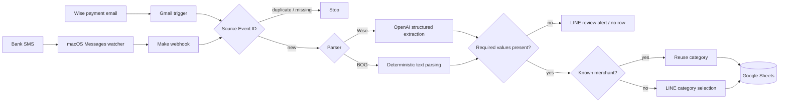

# Expense Tracker — 複数ソース対応の支出記録自動化

[English](README.en.md)

Wiseの決済メールと銀行SMSを取り込み、取引をGoogle Sheetsへ正規化して記録する個人向け支出管理オートメーションです。自由形式のメールだけをAIで解析し、固定形式のSMSは決定的ルールで処理します。未知のマーチャントに限り、LINEで人がカテゴリを選択します。

## 解決する業務課題

支出情報がメールとSMSに分散していると、金額・マーチャント・カテゴリを一つの台帳へ転記する作業が繰り返し発生します。一方、単純な自動化には次のリスクがあります。

- 自由形式の本文から金額やマーチャントを誤って推測する
- 再配信や再実行で同じ取引を二重登録する
- 新しいマーチャントのカテゴリを自動で決めつける
- 個人の取引情報や接続情報を公開成果物へ混入させる

このプロジェクトは、入力・解析・重複判定・カテゴリ選択を分離し、それぞれに適した安全境界を設けています。

## ソリューション

- **Wiseメール:** OpenAI Structured Outputsで `merchant / GEL / JPY` を抽出。値が不明なら `null` を返し、推測しない
- **BOG SMS:** 固定フォーマットをMakeの文字列関数で決定的に解析し、AIを呼び出さない
- **重複防止:** Gmail message IDまたはMessages GUIDを `Source Event ID` として記録前に照合
- **カテゴリ:** 既知マーチャントは過去カテゴリを再利用し、未知の場合だけLINEで人に確認
- **記録:** Google Sheetsを単一の台帳として使用
- **失敗時:** 必須値を抽出できなければLINEへ確認通知を送り、推測値や空欄の行は追加しない

## システム構成



モジュール単位の構成と拡張方法は[アーキテクチャ](docs/architecture.md)に記載しています。

## AI・決定的ルール・人の責任分担

| 担当 | 役割 |
|---|---|
| AI | 自由形式のWiseメールから、本文に明記されたマーチャント・GEL・JPYだけを構造化抽出 |
| 決定的ルール | BOG SMS解析、必須値検証、Source Event ID照合、既知カテゴリ再利用、Sheets行の追加・更新 |
| 人 | 未知マーチャントのカテゴリ選択、解析失敗通知の確認、接続先と実データの管理 |

AIはBOG SMSの解析、重複判定、カテゴリ確定には使いません。Wiseメールでも、入力に存在しない金額やマーチャントを補完する設計ではありません。

## 信頼性と安全性

- Source Event IDがない入力は、誤照合を避けるため処理を停止します。
- 同じSource Event IDが既にある場合は、解析・行追加・LINE通知へ進みません。
- 必須値が欠けた場合はfail closedとし、行を追加しません。
- macOS Messages DBはSQLiteの `mode=ro` で読み取り専用アクセスします。
- OpenAIモジュールは `store: false` / `createConversation: false` です。
- 公開Blueprintは接続ID、Webhook ID、Spreadsheet ID、LINEトークン、送信先IDをプレースホルダーへ置換しています。

ただし、Source Event IDの重複防止は「確認してから追加する」アプリケーションレベルの方式です。同一イベントが完全に同時実行された場合のatomicな一意性は保証しません。

## 証拠と検証範囲

このリポジトリで再実行できる公開成果物の検証:

```bash
python3 tests/validate_public_repo.py
```

検証スクリプトは、3つのBlueprintのJSON妥当性と構造、安全設定、プレースホルダー、秘密情報らしき文字列、ローカルwatcherの構文、必須ドキュメントを確認します。外部APIや実アカウントは操作しません。

別途記録されたライブ確認では、合成Wiseメールによる新規マーチャント経路と、LINEカテゴリ選択からSheets更新までの経路が観測されています。一方、現行BOG決定的パーサーの全経路、同一IDのライブ再送、Gmailの自然なスケジュール起動には未検証項目があります。

観測事実と `EVIDENCE_GAP` の正確な区分は[証拠記録](docs/evidence.md)を参照してください。

## 技術構成

- Make.com
- Google Sheets / Gmail
- OpenAI Responses API（Structured Outputs、Wiseのみ）
- LINE Messaging API
- Python 3（macOS Messages watcher、公開成果物検証）
- macOS Messages SQLite DB（読み取り専用）

## リポジトリの主な内容

- [`make/examples/`](make/examples/) — サニタイズ済みMake Blueprint 3件
- [`messages_watcher/`](messages_watcher/) — macOS MessagesからMake Webhookへ転送するローカルpoller
- [`docs/architecture.md`](docs/architecture.md) — システム構成と設計判断
- [`docs/setup.md`](docs/setup.md) — Google Sheets、Make、watcherの設定手順
- [`docs/evidence.md`](docs/evidence.md) — ライブ観測と未検証範囲
- [`docs/limitations.md`](docs/limitations.md) — 制約と非目標
- [`SECURITY.md`](SECURITY.md) — 公開・実行時のセキュリティ境界
- [`samples/sample_bog_sms.txt`](samples/sample_bog_sms.txt) — 架空データのSMSサンプル

## セットアップ

[セットアップ手順](docs/setup.md)に、Google SheetsのA–J列契約、3つのMakeシナリオ、Webhookペイロード、LINE連携、watcher、合成データによる確認手順を記載しています。

## プライバシー

実行時の取引データは複数サービスを通ります。

- Wiseメール本文は解析のためOpenAIへ送信されます。BOG SMSはOpenAIへ送りません。
- Make.comの実行履歴には各モジュールの入出力が残る場合があります。
- Google Sheetsは取引の恒久的な保存先です。
- LINEには、カテゴリ確認時のマーチャント名と金額、または解析失敗通知が送られます。
- watcherは送信者、本文、GUIDをWebhookへ送り、`is_from_me` と最終ROWIDなどの補助情報はローカルだけで使います。

保存期間や第三者サービスの設定を含む詳細は[セキュリティ方針](SECURITY.md)を確認してください。

## 現在の制約

このプロジェクトは本番運用可能、厳密なexactly-once、または事業ROIを主張していません。単一ユーザー・単一Sheets・単一LINE通知先を前提とし、watcherは手動起動です。BOGのJPY換算はBlueprint内の固定レートで、実勢レートへの自動追従はありません。

完全な一覧は[制約事項](docs/limitations.md)を参照してください。

## ライセンス

[MIT License](LICENSE)
