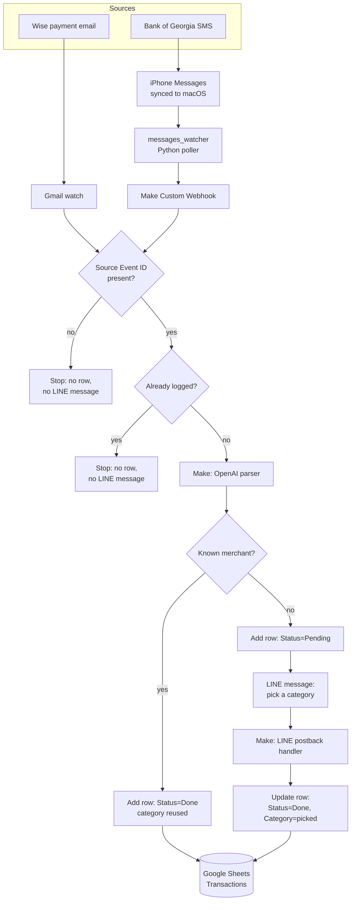

# Architecture

Expense Tracker ingests transactions from multiple sources, normalizes them with an
LLM, and logs them to a single Google Sheet. A human only steps in once per new
merchant, to pick a category — after that, repeat purchases from the same merchant
are filed automatically.

## Overview

## Components

| Component | Role |
|---|---|
| `messages_watcher/watcher.py` | Polls the local macOS Messages database (read-only) for new messages from a configured sender and forwards the text to a Make webhook. |
| Make Scenario 1 — Wise Expense Logger | Watches a Gmail inbox for Wise payment emails, checks the Gmail message ID against `Source Event ID` before parsing, then parses with OpenAI and logs new transactions. |
| Make Scenario 2 — LINE category handler | Reacts to the category buttons tapped in LINE, updates the matching row, and is shared by every ingestion scenario. When more pending rows remain, it reads the pending count from `Dashboard!Z1` and sends the next category prompt. |
| Make Scenario 3 — BOG SMS Expense Logger | Receives BOG SMS text (plus the message GUID) via the Custom Webhook, checks the GUID against `Source Event ID` before parsing, then parses with OpenAI and logs new transactions. Same downstream logic as Scenario 1. |
| Google Sheets | Single source of truth for logged transactions and the dashboard. `Transactions!J:J` stores stable source event IDs; `Dashboard!Z1` contains the pending-row count used by Scenario 2. |

## Design notes

- **One shared category workflow.** Both ingestion scenarios (Wise, BOG) write into
  the same "Transactions" sheet and hand off unclassified merchants to the same LINE
  category-selection scenario. Adding a new source only means adding a new entry
  scenario — the classification/logging logic is reused as-is.
- **Event-level deduplication is separate from merchant classification.** Two
  independent checks run per transaction, and they are not the same thing:
  - *Source Event ID check* (this section's diagram) — before any OpenAI parsing
    happens, the scenario first confirms the incoming event actually has a stable ID
    (Gmail message ID for Wise, Messages GUID for BOG); if it doesn't, the run stops
    right there rather than risk a blank ID matching the wrong row. If the ID is
    present, it's looked up in the `Source Event ID` column — a match means this
    exact transaction was already logged (e.g. Gmail redelivery, a watcher restart
    resending a message, a manual re-run in Make), so the scenario stops with no new
    row and no LINE message. This is check-then-insert duplicate prevention for
    normal retries/redelivery, not an atomic uniqueness guarantee against two
    simultaneous executions of the same event.
  - *Known-merchant shortcut* — only for transactions that pass the check above,
    the scenario looks up whether this **merchant** already has a `Done` row so the
    category can be reused instead of prompting over LINE again. This is about
    classification convenience, not duplicate prevention — the same merchant is
    expected to recur many times.
- **Local, read-only Messages access.** `messages_watcher` opens `chat.db` with
  `mode=ro` and never writes to it. Only the sender, message text, and message GUID
  (forwarded as the Source Event ID) are sent to the webhook; other fields it reads
  locally for filtering (e.g. `is_from_me`) and the last processed `ROWID` it keeps as
  state stay on disk and are never sent anywhere.
- **No new fixed exchange rate unless explicitly needed.** The Wise scenario relies on
  the email body / model estimate for JPY. The BOG scenario computes JPY with a fixed
  rate (see [setup.md](setup.md)) since BOG SMS never includes a JPY figure — this is
  a deliberate, documented exception, not a default behavior.

## Extending to a new source

To add another input channel (another bank's SMS, a CSV import, a different chat
platform, etc.):

1. Create a new entry scenario that produces a stable per-event ID (a message ID, a
   GUID, anything the source itself guarantees is unique) plus raw text → OpenAI
   parser → `merchant / amount / currency` fields.
2. Add the same `Source Event ID` presence-check + lookup-and-gate used by Scenarios 1
   and 3 before parsing, so re-delivery from the new source doesn't create duplicate
   rows during normal retries.
3. Reuse the existing "known merchant?" check, row logging, and LINE category handoff
   unchanged.
4. Do not fork the category-selection scenario — keep it shared across all sources.
